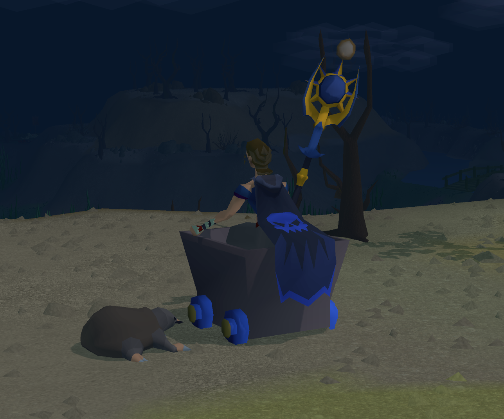

# Station's Cozy Carts



Station's Cozy Carts is a cosmetic RuneLite plugin that places the local player
inside a customizable native Old School RuneScape minecart.

## Features

- Ride a client-side minecart that follows your position and facing.
- Choose separate idle, walk, and run rider animations: minecart, sitting, or skis.
- Recolour the cart body, wheels, and wheel hubs independently.
- Adjust cart size, facing correction, and height.
- Hide your cape, weapon, or shield while riding.
- Mount or dismount from a movable, resizable on-screen cart button.
- Optionally play a small native smoke-poof effect when mounting or dismounting.
- Reset the cart and rider pose from the configuration panel if needed.

Everything is cosmetic and client-side. Other players do not see the cart or rider
changes, and the plugin does not automate movement or game actions.

## Controls

Enable **Station's Cozy Carts**, then click the cart button in the game view to mount
or dismount. Hold Alt and drag the overlay to move it using RuneLite's standard
overlay controls. All appearance and animation options are available in the plugin
configuration panel.

## Running locally

The project requires Java 11 or newer.

```text
gradlew.bat test
gradlew.bat run
```

## License

BSD 2-Clause. See [LICENSE](LICENSE).